---

<h2 align="center">💫 Curious About Data, Driven by Code</h2>

I enjoy turning **messy data into clear answers** and simple ideas into working code. Some days that means exploring a dataset with Python, other days it means writing a better SQL query or designing a dashboard that makes the important details impossible to miss.

<table>
<tr>
<td width="33%" align="center">
<strong>🧩 What I Enjoy</strong>  
Solving problems · Finding patterns 
Writing clean, useful code
</td>
<td width="33%" align="center">
<strong>📊 What I'm Exploring</strong>  
SQL case studies · Python analysis 
Power BI · DAX · Dashboard design
</td>
<td width="33%" align="center">
<strong>🚀 What I'm Creating</strong>  
Dashboards · Analysis projects 
Small tools that make work easier
</td>
</tr>
</table>

> 💡 **My favourite kind of problem:** messy operational data that needs a clear, useful answer.

🤝 I'm always happy to talk about **SQL, Excel, dashboards, coding projects**, or the journey into data analytics.

---

<h2 align="center">🌟 Featured Work</h2>

<table>
<tr>
<td width="33%" valign="top">
<h3 align="center">📊 HR Analytics</h3>

<strong>Power BI · DAX · Power Query</strong>

Interactive dashboard exploring employee distribution, salary trends, tenure, and workforce insights.
  

<a href="https://github.com/vishxltanwar/HR-Analytics-PowerBI"><strong>Explore project →</strong></a>

</td>
<td width="33%" valign="top">
<h3 align="center">🎬 Netflix EDA</h3>

<strong>Python · Pandas · Jupyter</strong>

Exploratory analysis of content types, genres, countries, ratings, and platform growth.
  

<a href="https://github.com/vishxltanwar/netflix-data-analysis"><strong>Explore project →</strong></a>

</td>
<td width="33%" valign="top">
<h3 align="center">🛒 Sales Analysis</h3>

<strong>SQL · Queries · Insights</strong>

A focused SQL mini-project for exploring customer and sales data through practical business questions.
  

<a href="https://github.com/vishxltanwar/sql-customer-sales-analysis"><strong>Explore project →</strong></a>

</td>
</tr>
</table>

---

<h2 align="center">🧰 My Toolkit</h2>

<strong>Data &amp; Analytics</strong>  

<strong>Databases &amp; Backend</strong>  

<strong>Development</strong>  

---

<h2 align="center">📊 GitHub Activity</h2>

---

<h2 align="center">🐍 Contribution Trail</h2>

<picture>
  <source media="(prefers-color-scheme: dark)" srcset="./profile/github-contribution-grid-snake-dark.svg" />
  <source media="(prefers-color-scheme: light)" srcset="./profile/github-contribution-grid-snake.svg" />
  
</picture>

---

<h2 align="center">🌐 Let's Connect</h2>

---

<i>💡 Turning raw data into decisions, one query at a time.</i>

